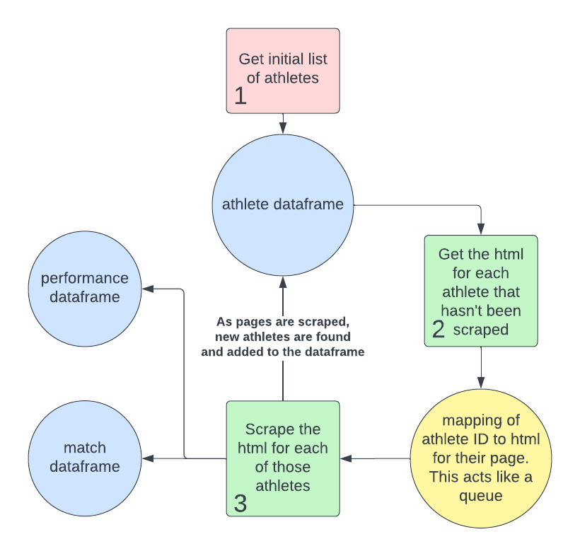

# bjjstats
A dashboard app to visualize the records of the top Brazilian Jiu Jitsu athletes.
The purpose of this project is to try out Lambda, Step Functions, and EventBridge for setting up
an automated pipeline and to test out creating a public web app with API Gateway and Lambda, just
to see how viable that is for custom dashboards. I'll soon be trying out IaC with Terraform soon as well.

#### Findings:
- Lambda is great for running small, stateless functions, but it's not great for running long-running
processes.
- Step Functions are easy to set up and troubleshooting is easy with the visual interface.
- Plotly is too slow in the implementation I set up here, with the endpoints taking about 2 minutes to
return a response.

## Architecture
ETL design:

The pipeline is triggered by an eventbridge rule that runs the ETL process once a month.

Todo list:

- [x] write first web app endpoint with test data
- [x] write load function script
- [x] write async extract and transform function script
- [x] create docker containers for extract and load functions
- [x] set up lambda functions to run the docker containers
- [x] set up step function to automate the ETL pipeline with eventbridge
event to schedule regular data updates

--------------------------------

## Quickstart Pre-Reqs

 - clone the repository locally
 - in the `bjjstats` directory,
do `pip install -r requirements.txt` for setup
 - run the tests with `DB_URL=sqlite:///test.db pytest tests -v`
 - set up pre-commit hooks with `pre-commit install` (this repo uses
black, flake8, and mypy)

#### Try the pipeline locally
> **_NOTE:_**  The `extract.py` script takes an optional argument of an integer to limit the number of pages to scrape. This is useful for testing the pipeline with a smaller dataset to save time. e.g. `python pipeline/extract/extract.py 10`

with local csv files:
 - run `python pipeline/extract/extract.py --output pipeline/load` to extract and transform the data to the `pipeline/load` directory.
 - run `DB_URL=sqlite:///test.db python pipeline/load/load.py pipeline/load/athlete.csv pipeline/load/performance.csv pipeline/load/match.csv` to load the data into a local sqlite database

with parquet files uploaded to s3:

Make sure you have [aws credentials set up](https://boto3.amazonaws.com/v1/documentation/api/latest/guide/credentials.html).
In s3, create a bucket called `bjjstats` with a directory named `bjjheroes-scrape-v1`

- run `python pipeline/extract/extract.py --s3 'folder name'`
- run `DB_URL=sqlite:///test.db python pipeline/load/load.py --s3 'folder name'`

----------------------------
### Schema
This schema represents a many-to-many relationship between athletes
and matches via the performance table.

`athlete` One entry per athlete

| field    | meaning                       |
|----------|-------------------------------|
| name     | Athletes full name. Required. |
| nickname | Optional.           |
| url      | The page used to scrape the data |

`performance` Each athlete has 1 performance for each match they participated in.

| field  | meaning                     |
|--------|-----------------------------|
| result | Win/Loss/Draw               |

`match` One entry per match, each match is linked to two performances,
one performance from each athlete participating in the match

| field       | meaning                                                              |
|-------------|----------------------------------------------------------------------|
| year        | integer                                                              |
| competition | the name of the promotion (eg ADCC, IBJJF Worlds, IBJJF Euros, AIGA) |
| method      | how the match was won (eg. armbar, points (2-0), DQ)                 |
| stage       | the stage of the tournament eg quarterfinals, semifinals, finals     |
| weight      | the official weight class of the match                               |

### Scraper (Extract and Transform Lambda)

###### note: this was refactored to not use dataframes because they were too slow. The process is still the same, but the data is stored in sets of objects instead of dataframes.

In the diagram above, the blue circles represent the data that the scraper returns, and the green
squares represent processes that will be run in a loop until all the athletes in the ~~dataframe~~ set have
been marked as done.

This scraper is complicated due to the fact that not all athlete page links are located on the main
a-z list of athletes, some are found on the pages of other athletes. This means that as we scrape the
athlete pages, we will find new athlete pages to scrape. We use a column in the athlete ~~dataframe~~ set to
track which pages have been scraped and which have not.

Also in order to improve the speed of the scraping, we use asyncio to download the htmls of the athlete
pages asynchronously. However, we do not convert the html pages to BeautifulSoup objects in async because
this requires a lot of memory. In order to strike a medium between speed and memory usage, we download the
htmls in parallel and then convert them to BeautifulSoup objects in series.
