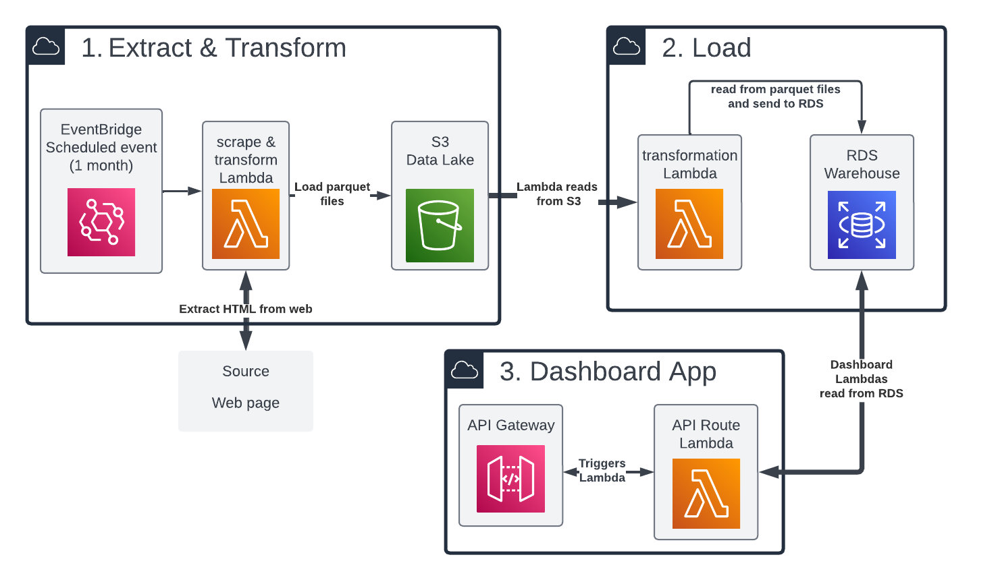

# bjjstats
A dashboard app to visualize the records of the top cBrazilian Jiu Jitsu athletes.

## Architecture
Batch ETL design:

#### Key behavior of this design
Once a month, the entire warehouse is deleted and recreated using the
latest data pulled from the website. When the data is pulled each month,
it is stored in s3 before it is loaded into the warehouse. The lambda
functions are stored as Docker containers in ECS.

##### Why this design?
This design is chosen because it is simple and cost-effective. I could
choose to insert only the newest matches that were added to the source
data, but this would require complex logic to determine which matches
are already in the database.

Todo list:

- [x] write first web app endpoint with test data
- [x] write load function script
- [x] write async extract and transform function script
- [ ] create docker containers for extract and load functions
- [ ] set up lambda functions to run the docker containers
- [ ] set up step function to automate the ETL pipeline with eventbridge
event to schedule regular data updates

--------------------------------

## Quickstart Pre-Reqs

 - clone the repository locally
 - in the `bjjstats` directory,
do `pip install -r requirements.txt` for setup
 - run the tests with `DB_URL=sqlite:///test.db pytest tests -v`
 - set up pre-commit hooks with `pre-commit install` (this repo uses
black, flake8, and mypy)

#### Try the pipeline locally
> **_NOTE:_**  The `extract.py` script takes an optional argument of an integer to limit the number of pages to scrape. This is useful for testing the pipeline with a smaller dataset to save time. e.g. `python pipeline/extract/extract.py 10`

with local csv files:
 - run `python pipeline/extract/extract.py --output pipeline/load` to extract and transform the data to the `pipeline/load` directory.
 - run `DB_URL=sqlite:///test.db python pipeline/load/load.py pipeline/load/athlete.csv pipeline/load/performance.csv pipeline/load/match.csv` to load the data into a local sqlite database

with parquet files uploaded to s3:

Make sure you have [aws credentials set up](https://boto3.amazonaws.com/v1/documentation/api/latest/guide/credentials.html).
In s3, create a bucket called `bjjstats` with a directory named `bjjheroes-scrape-v1`

- run `python pipeline/extract/extract.py --s3 'folder name'`
- run `DB_URL=sqlite:///test.db python pipeline/load/load.py --s3 'folder name'`

----------------------------
### Schema
This schema represents a many-to-many relationship between athletes
and matches via the performance table.

`athlete` One entry per athlete

| field    | meaning                       |
|----------|-------------------------------|
| name     | Athletes full name. Required. |
| nickname | Optional.           |
| url      | The page used to scrape the data |

`performance` Each athlete has 1 performance for each match they participated in.

| field  | meaning                     |
|--------|-----------------------------|
| result | Win/Loss/Draw               |

`match` One entry per match, each match is linked to two performances,
one performance from each athlete participating in the match

| field       | meaning                                                              |
|-------------|----------------------------------------------------------------------|
| year        | integer                                                              |
| competition | the name of the promotion (eg ADCC, IBJJF Worlds, IBJJF Euros, AIGA) |
| method      | how the match was won (eg. armbar, points (2-0), DQ)                 |
| stage       | the stage of the tournament eg quarterfinals, semifinals, finals     |
| weight      | the official weight class of the match                               |
